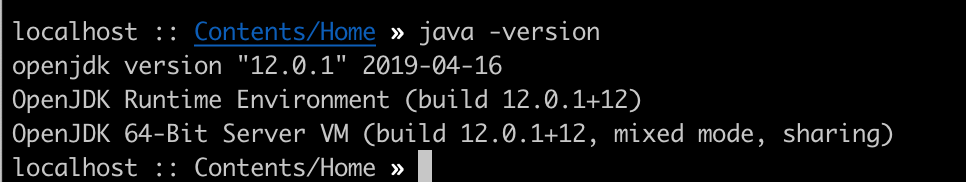
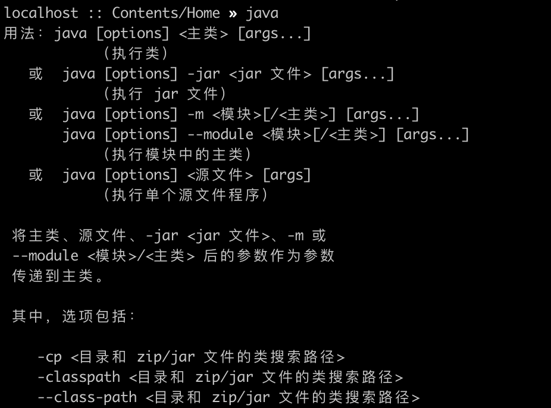

# Mac 安装Java环境

1.在安装JDK之前，先检查自己电脑是否已经安装；

​	打开终端，输入java -version并回车。

 

 	从上图中可以看出我们已安装了，JDK 8。如果这个版本是你需要的版本，可直接看4配置Java开发环境。

2. 下载所需要的JDK版本 (https://github.com/zyy215/Java)

3. JDK安装，MAC系统JDK安装是很简单的，一路下一步就ok了。

4. 配置java开发环境

   **MAC默认安装目录为/Library/Java/JavaVirtualMachines/**

   打开终端窗口：

   ```linux
    cd /Library/Java/JavaVirtualMachines/jdk1.8.0_144.jdk/Contents/Home
    
    //输入sudo -i vi /etc/.bash_profile，并回车；
    sudo -i vi /etc/.bash_profile
    
    //输入密码并回车，在弹出的页面中按i键开始输入以下内容
     JAVA_HOME=/Library/Java/JavaVirtualMachines/jdk1.8.0_101.jdk/Contents/Home/
   
     CLASSPAHT=.:$JAVA_HOME/lib/dt.jar:$JAVA_HOME/lib/tools.jar
   
     PATH=$JAVA_HOME/bin:$PATH:
   
     export JAVA_HOME
   
     export CLASSPATH
   
     export PATH
     
    //完成后按esc键退出编辑，再输入:wq 保存刚刚的操作
   
    //输入  source /etc/.bash_profile并回车，使配置生效
    source /etc/.bash_profile
   ```

   在终端输入java和javac 分别出现如下界面，则配置成功。

   

5.编写一段程序并执行

​		刚开始可以用文本编辑器写程序，保存为后缀为.java的Java文件

​		打开文本编辑器，输入以下代码，保存为Hello.java：		

```java
public class Hello{

  	public static void main (String args[]){

				System.out.println("你好，很高兴学习java");

	} }
```

​	找到该Java文件所在的位置：/Users/zyy/java

​	打开终端，输入 cd /Users/zyy/java

​	然后输入 javac Hello.java

​	然后输入 java Hello  （注意，此时是不需要带后缀.java）

​	最后屏幕输出“你好，很高兴学习java” 

成功！